<div align="center">
<picture>
  <source media="(prefers-color-scheme: dark)" srcset=".github/brand/banner-night.svg">
  
</picture>
<br><br>
<a href="#about"><picture><source media="(prefers-color-scheme: dark)" srcset=".github/brand/tab-about-night.svg"></picture></a>
<a href="#components"><picture><source media="(prefers-color-scheme: dark)" srcset=".github/brand/tab-components-night.svg"></picture></a>
<a href="#quickstart"><picture><source media="(prefers-color-scheme: dark)" srcset=".github/brand/tab-quickstart-night.svg"></picture></a>
</div>

<p>
<a name="about"></a>
<picture><source media="(prefers-color-scheme: dark)" srcset=".github/brand/section-about-night.svg"></picture>
</p>

Zvezda is a multi-repository Git toolkit: it commits, syncs, and clones across every repo you own without you typing `git add . && git commit -m "..."` fifteen times a day. A local LLM (Ollama / Mistral) writes the commit messages; Zvezda handles the batching.

It's the original Python + Go repo manager — the predecessor to [Iskra](https://github.com/NoamFav/Iskra).

<p>
<a name="components"></a>
<picture><source media="(prefers-color-scheme: dark)" srcset=".github/brand/section-components-night.svg"></picture>
</p>

| Component | Language | Purpose |
|-----------|----------|---------|
| `ai_commit` | Go | AI-generated commit messages via Ollama |
| `auto_commit` | Python | Batch commit across multiple repos |
| `pull_repos` | Python | Bulk clone from GitHub |

**Features:** conventional commit format · rich terminal UI with progress tracking · per-repo filtering (`--only`) · pull-before-commit (`--pull`)

<p>
<a name="quickstart"></a>
<picture><source media="(prefers-color-scheme: dark)" srcset=".github/brand/section-quickstart-night.svg"></picture>
</p>

```sh
git clone https://github.com/NoamFav/Zvezda && cd Zvezda

pip install -r requirements.txt
cd src/ai_commit && go build -o ai_commit && sudo mv ai_commit /usr/local/bin/

# AI commit for the current repo
ai_commit

# Batch commit every repo
auto_commit

# Clone all your GitHub repos
pull_repos

# Scoped / with a pull first
auto_commit --only my-project
auto_commit --pull
```

<div align="center">

Made with ♥ by [NoamFav](https://github.com/NoamFav) · MIT License

</div>

<br>

<a href="https://nf-software.com">
<picture>
  <source media="(prefers-color-scheme: dark)" srcset=".github/brand/footer-night.svg">
  
</picture>
</a>
